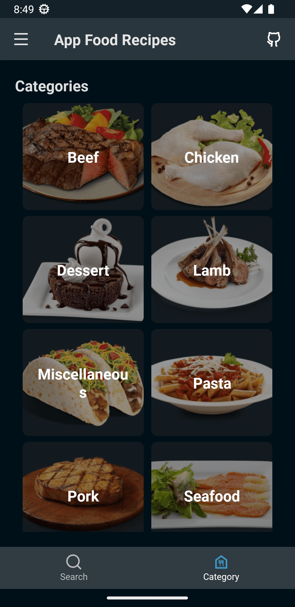

# Food Recipes App
Aplicación de Android que consume [TheMealDB](https://www.themealdb.com/). 

## Demo
<table>
    <tr>
        <td> Home </td>
        <td> Home Dark </td>
        <td> Categories </td>
        <td> Categories Dark </td>
    </tr> 
    <tr>
       <td> Recipe Detail </td>
        <td> Recipe Detail Dark </td>
        <td> Recipe Map </td>
        <td> Recipe Map Dark </td>
    </tr> 
</table>

### Stack

It's using:

- MVVM with coroutines
- Clean Architecture
- Jetpack Compose
- Google Maps
- Hilt
- Arrow Kt (Typed Functional Programming)
- Retrofit
- Moshi
- Glide from landscapist library
- Vitamin Compose (UI Library)
- ...

## Architecture

- app: Presentation Layer
- domain: Business Logic Layer
- data: Data Access Layer

## TODO
- [ ] End to end test
- [ ] Unit test
- [ ] CI/CD (Github Actions, Bitrise, Fastlane)
- [ ] Firebase Crashlytics
- [ ] Firebase Analytics
- [ ] Añadir DataStore para almacenar las preferencias del usuario (Like, Dislike, etc)
- [ ] Habilitar la opcion de ingredientes

## Contributions
No dude usar los [Issues](https://github.com/NearApps/FoodRecipesChallenge/issues) para presentar un problema por errores, sugerencias o solicitudes de funciones.