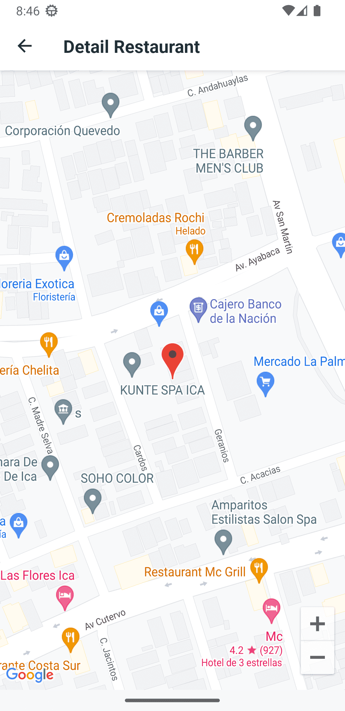
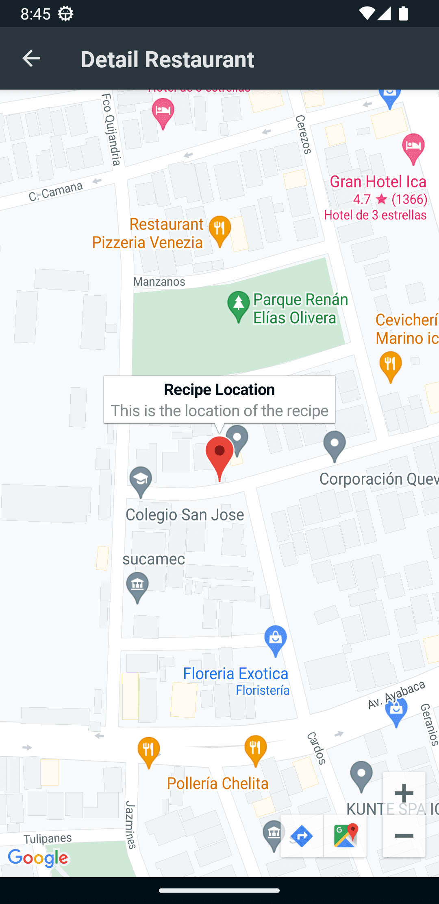

# Food Recipes App
Aplicación de Android que consume [TheMealDB](https://www.themealdb.com/).
Se ha construido con:
principios de arquitectura limpia, patrón de repositorio y patrón MVVM, así como componentes de arquitectura.

## Demo
<table>
    <tr>
        <td> </td>
        <td> </td>
        <td> </td>
        <td> </td>
    </tr> 
    <tr>
       <td> </td>
        <td> </td>
        <td> </td>
        <td> </td>
    </tr> 
</table>

### Stack

It's using:

- MVVM with coroutines
- Clean Architecture
- Jetpack Compose
- Google Maps
- Hilt
- Arrow
- Retrofit
- Moshi
- Glide
- ...

## Architecture

- app: Presentation Layer
- domain: Business Logic Layer
- data: Data Access Layer

## TODO
- [ ] End to end test
- [ ] Unit test
- [ ] CI/CD (Github Actions, Bitrise, Fastlane)
- [ ] Firebase Crashlytics
- [ ] Firebase Analytics
- [ ] Añadir DataStore para almacenar las preferencias del usuario (Like, Dislike, etc)
- [ ] Habilitar la opcion de ingredientes

## Contributions
No dude usar los [Issues](https://github.com/NearApps/FoodRecipesChallenge/issues) para presentar un problema por errores, sugerencias o solicitudes de funciones.